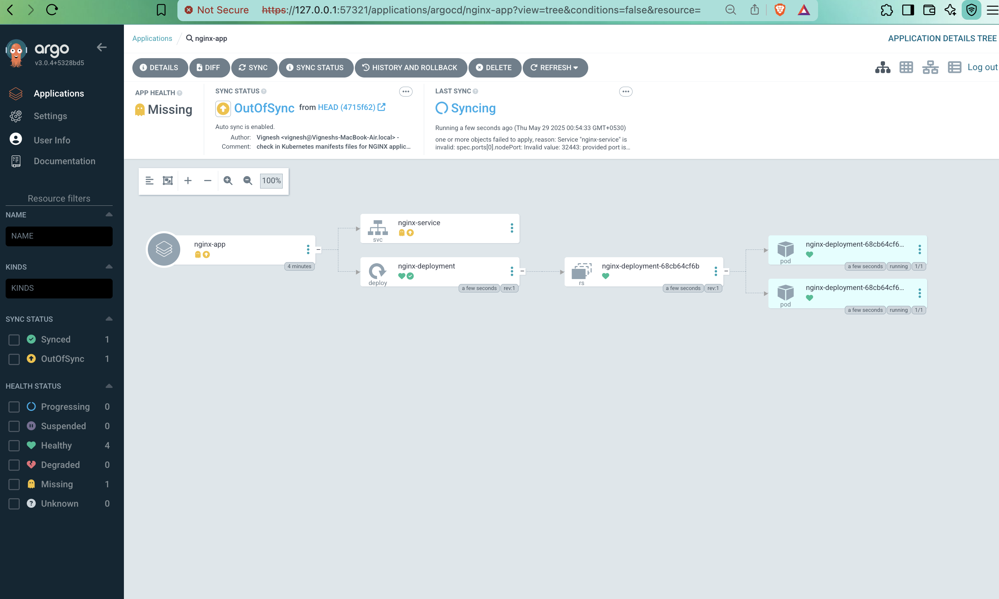

# EKS Infrastructure with Terraform

This repository contains a modular Terraform configuration for deploying an Amazon EKS cluster with the following components:

- VPC with public and private subnets
- EKS cluster
- IAM roles and policies
- Node groups for worker nodes

## Prerequisites

- AWS CLI configured with the "dev" profile
- Terraform installed
- kubectl installed

## Usage

1. Initialize Terraform:
   ```bash
   terraform init
   ```

2. Review the planned changes:
   ```bash
   terraform plan
   ```

3. Apply the configuration:
   ```bash
   terraform apply
   ```

4. After the infrastructure is created, you can get the kubeconfig:
   ```bash
   terraform output kubeconfig > kubeconfig.yaml
   export KUBECONFIG=kubeconfig.yaml
   ```

5. Verify the cluster is accessible:
   ```bash
   kubectl get nodes
   ```

## Cleanup

To destroy the infrastructure:
```bash
terraform destroy
```

## Configuration

The main configuration can be modified in `main.tf`. Key parameters include:

- VPC CIDR block
- Availability zones
- Subnet CIDR blocks
- EKS cluster version
- Node group configuration

## Security

- The EKS cluster is created with both private and public endpoint access
- Worker nodes are placed in private subnets
- IAM roles follow the principle of least privilege
- Security groups are configured to allow necessary traffic

## Infrastructure Requirements

To ensure reproducible and consistent deployments, this repository pins all infrastructure tool versions:

- **Terraform:** `~> 1.10.4` (see `versions.tf`)
- **AWS Provider:** `~> 5.98.0`
- **TLS Provider:** `~> 4.1.0`
- **Time Provider:** `~> 0.13.1`
- **CloudInit Provider:** `~> 2.3.7`
- **Null Provider:** `~> 3.2.4`
- **AWS CLI:** `2.24.18` (please install this version for compatibility)

Provider versions are locked in `versions.tf` and `.terraform.lock.hcl`.  
**Always run `terraform init` after cloning to ensure correct provider versions.**

## ArgoCD Usage

### Prerequisites
- Ensure your `kubectl` is configured to point to your target Kubernetes cluster (e.g., via `export KUBECONFIG=kubeconfig.yaml` as described above).

### Steps
1. Run the ArgoCD setup script:
   ```bash
   ./argocd/setup-argocd.sh
   ```
   This script will:
   - Create the `argocd` namespace (if not already present)
   - Install ArgoCD
   - Wait for the ArgoCD server to be ready
   - Print the ArgoCD admin credentials and the login link
   - Start port-forwarding ArgoCD to your localhost

2. Open the printed link in your browser (e.g., https://localhost:4444), and log in using the provided credentials.

3. Apply the ArgoCD application manifest:
   ```bash
   kubectl apply -f argocd/nginx-app.yml
   ```

4. You should now see the NGINX app created and managed in the ArgoCD UI.


